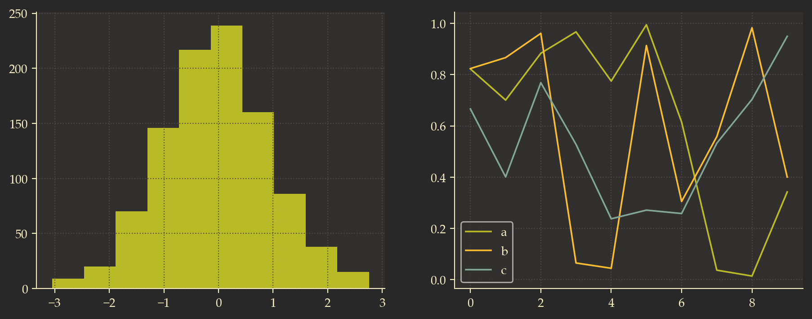
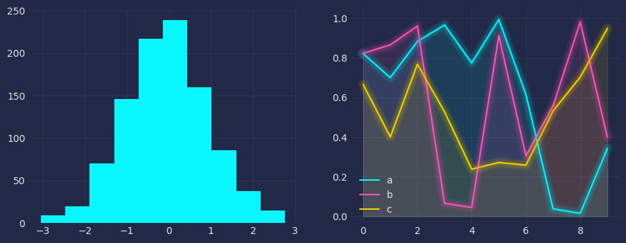

# Matplotlib custom stylesheets

A list of awesome custom stylesheets for matplotlib

## Stylesheets

- [**Built-in stylesheets**](https://matplotlib.org/stable/gallery/style_sheets/style_sheets_reference.html)

The names of the available style sheets can be found in the list `matplotlib.style.available`

---

- [**Grubox-mpl**](https://github.com/thriveth/gruvbox-mpl/tree/master):

A simple, dark-background color style for the Matplotlib based on Pavel Pertsev's [Gruvbox](https://github.com/morhetz/gruvbox) color palette

- [**Mplcyberpunk**](https://github.com/dhaitz/mplcyberpunk/)

A Python package on top of matplotlib to create 'cyberpunk' style plots with 3 additional lines of code.

Images of GitHub stars are provided by [Shields.io](https://shields.io/badges)
